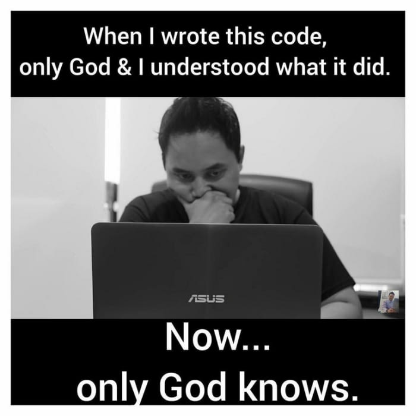
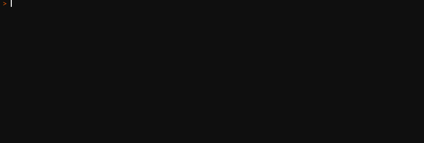
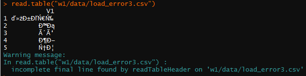

```{r setup, include=FALSE}
knitr::opts_chunk$set(echo = FALSE, ffmpeg.format = "gif")
library(animation)
library(magrittr)
```
## Structure
- Introduction & Course Overview
- Project suggestions
- ETL process


# Introduction & Course Overview

## About me
- Michal Kubi&#353;ta
- Main focus: European FMCG retail market
- Contact: michal.kubista@nielsen.com
- Office hours: upon prior arrangment 
- I'm bad with names ... *sorry*
- <font color = "orange">**please include string "MDA2018" in your email subject** </font>

## Organization
- Monday: 16:15 - 19:30
- Tuesday: 9:30 - 11:00
    - additional seminar used to wrap up more complex topics (like this week)
    - otherwise can be used for consultations (pre-agreed via email)

## Content
- topics in marketing analysis
    + customer segmentation
    + pricing strategies
- algorithms 
    + distance-based techniques
    + CART type algorithms
    + neural networks
- ETL process !!!

## Grading
- project - *no worries in the exam period*
- 4 deadlines
    + describe your project (15 p)
    + get and clean the data (25 p)
    + analyse (40 p)
    + present (20 p)

- <font color= "orange"> **conditions to pass** </font>
    + <font color= "orange"> at least 60p in total </font>
    + <font color= "orange"> at least 60 % at each deadline </font> 
- submit via Github

## Grading - project description
- documentation
- what will you analyse (churn, baskets, prices)
    - what data will be used
- why (predict churn, optimise prices)
- how (logit, mixed-effects lm)
- outcome discussion

## Grading - data & tidiness
- sufficiency = "can the analysis be done with this data?"
    + use <font color = "orange">**several sources**</font>
- reproducibility
    + try to get the data through R, or include all the sources (links)
- [tidy data](http://vita.had.co.nz/papers/tidy-data.pdf) - more on that in the second part
- <font color = "orange">**don't erase used commands & comment extensively**</font>
    + I want to see all the used commands (e.g. *summary*, *str*)
    + comment what is happening and how will you handle it
    + it is part of the flow of the project & it helps me understand that you know what you are doing
- feature engineering and splitting can be done later
- objective: data already prepare for the algorithm run

## Grading - analysis
- usage of the model
    + should be discussed in advance
- understanding the process
    + all the cross-validation, parameter tuning, ...
    + why am I using this value for parameter "xy"?
    + if several possible values, <font color = "orange">**discuss**</font>
- <font color = "orange">**don't erase used commands & comment extensively**</font>
    + I want to see all the used commands
    + comment what is happening and how to handle it
    + it is part of the flow of the project & it helps me understand that you know what you are doing
- model results interpretation

## Why commenting? {.flexbox .vcenter}



## Grading - final output
- presented in the class
- co-evaluated by your classmates
- prepare :
    + problem overview
    + methodology introduction and discussion
    + nice visualisations (you want to sell your product)

## Bonus points
- few options during the course
- play a game, prove some theory, calculate, suggest an approach
- in a form of home assignments
- achieving more than 100% score results in some sweet reward
- will not save you from failing

- this week:
    + play the game **CastleOfR** (originally written by [Giora Simchoni](https://github.com/gsimchoni/CastleOfR))
    + *what do the dragons like?*
    + email me the answer and get the points
    + 2p up for the final grade


## Github
- make an account
- [check the repo](https://github.com/MDA2018/lectures) (and watch it)

- download the slides (sources)
- should you find any mistake in the materials
    + suggest edit via pull request
- submit done via [Github classroom](https://classroom.github.com/a/KtcVpIMo)

    + submitting sooner means more time to discuss before the deadline

##  {.flexbox .vcenter}

<font size="24" color ="orange"> **Questions?** </font>  

# Project suggestions

## Sample projects
- recommendation systems
    - get the ratings and movie features
    - data overview
    - build several models (w3)
    - combine predictions
- basket analysis
    - data overview
        - enrich by weather data?
    - product &| customer segmentation (w4)
    - association rules (w2)
    - personalised offers (w3)

## Sample projects (ii)
- pricing analysis
    - data overview
        - enrich by weather data?
    - product segmentation (w4) / ranking (pareto)
    - pricing strategy (w6)
- customer loyalty / churn
    - data overview
    - (price and promotion) segmentation (w4)
        - shopping missions
    - churn analysis (w7)

# ETL process

## The most important step of the project
- find the data?
- find the best algorithm for the analysis?
- visualisation and meaningful insights?
- something completely different?

## Loading the data!


```{r test_anim, fig.show='animate', eval = FALSE}

for(i in 1:nrow(mtcars)){
      plot(mtcars$mpg[1:i], mtcars$disp[1:i])
}
```

## What now?
- data can't be read into R 
- no metadata available
- file too large to be opened in common tools (notepad, excel)


## Column error? => header & fill
```{r head&fill, echo = TRUE}
read.csv("data/lecture/load_error.csv", header = FALSE, fill = TRUE)
```


## Line-specific error? => skip & nrows


```{r readlines, echo = TRUE}
read.table("data/lecture/load_error2.csv", fill = FALSE, skip = 1, nrows = 2)
```

## Encoding problem?


  

## Encoding solution
```{r, echo = TRUE}
read.table("data/lecture/load_error3.csv", encoding = "UTF-8", stringsAsFactors = FALSE) %>% View()
```

> - more on encoding [here](https://www.joelonsoftware.com/2003/10/08/the-absolute-minimum-every-software-developer-absolutely-positively-must-know-about-unicode-and-character-sets-no-excuses/) & [here](http://kunststube.net/encoding/)

<!-- HOW DOES R SEE THOSE CHARACTERS NOW? -->
```{r, eval = FALSE}
test <- read.table("data/lecture/load_error3.csv", encoding = "UTF-8", stringsAsFactors = FALSE)
test$V1
```
## Unknown separators?


> - becomes problem with large files
> - readLines again

## Any other troubles?
> - readLines
> - fread (data.table package)
> - <font color = "orange">**good luck** </font>
