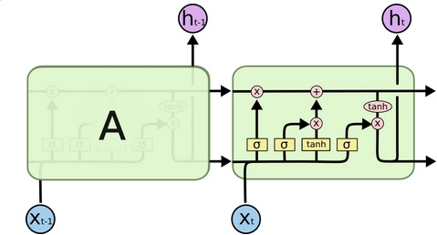
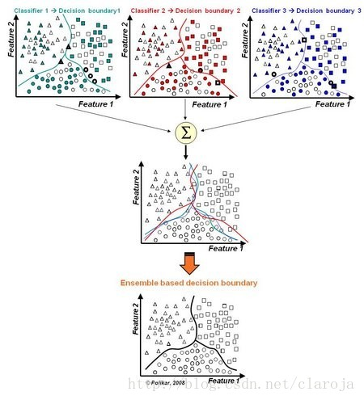

```{r setup, include=FALSE}
knitr::opts_chunk$set(echo = FALSE, ffmpeg.format = "mp4",
                      cache = TRUE, fig.align = 'center',
                      fig.width = 8, fig.height = 5)
```

## Structure
1. Neural networks
2. Self Organising Maps
3. Recap

# Neural networks

## Introduction
- aritificial neural networks, deep learning, AI
- basically a whole new field
    - statistics **|** machine learning **|** deep learnings
- basic terminology
    - neuron
    - layers
        - input, hidden, output
    - bias, weights, activation function
- similar to linear regression
    - master of feature engineering (... PCA)
    
## Types


- compiled by [Azimov Institute](http://www.asimovinstitute.org/neural-network-zoo/)
- many different types
</br>
</br>
    - different neuron types 
    - different preprocessing methods
    - different activation functions

## Activation functions
- binary
- linear
- sigmoid $$f(x) = \frac{1}{1+e^{-x}}$$
- tanh $$f(x) = \frac{e^{x} - e^{-x}}{e^{x} + e^{-x}}$$
- ReLU
$$f(x) = \begin{cases} 0 & \text{if $x < 0$} \\ x & \text{if $x \ge 0$} \end{cases}$$

## Estimation: feed-forward network
1. initialize with random weights
2. do the forward pass
3. calculate the errors
4. do the backward pass
    - find which weights contribute to the error the most
    - via backpropagation
        - chain rule
5. iterate through steps 2. - 4.
    - until convergence or fixed number of epochs

## Autoencoders
- unsupervised learning
- symmetrical structure
- decreasing number of neurons towards the center
    - central layer is the smallest
  
- trying to predict x from x using with small number of neurons
    - looking for underlying structures in the data
  
- usage:
    - (image) noise removal
    - clustering

## Convolutional
- 2D input
    - images
- processing by windows
  
- convolutional layers
    - 2D layer
    - elementwise multiplication of data and filter
- pooling layers
    - downsampling by aggregation
    - usually maximum

## Recurrent
- sequences
    - text, time series
- remembering previous values
- [LSTM units](https://ahmedhanibrahim.wordpress.com/2016/10/09/another-lstm-tutorial/)
    - input, forget, output gates



## Summary
- complex structure
    - layers of different structure
        - type (convolution, LSTM)
        - size
        - activation function
    - weights and biases
- black box
- hard to saturate
    - needs large quantities of data
- completely new way analysis
    - handling unsolved problems

# Self Organising Maps

## Introduction
- unsupervised learning / dimensionality reduction
- clustering based on neural-network-like structure
- cluster basis is a grid A x B
    - user specified
- results in A x B clusters
- advantage against k-Means
    - relative position of the clusters explains the similarity

## Estimation
1. assign a random weight to each neuron
    - weight = small vector
2. randomly choose a single observation from data
3. find BMU (best matching unit)
    - the closest neuron
4. calculate the updates
    - neighbourhood parameter
    - time and distance decay
5. update the weight of the neuron and its neighbours
    - neighbours determined by neighbourhood parameter
        - moving less than BMU
6. repeat steps 2. - 5. until iterations limit

## [Organising](https://algobeans.com/2017/11/02/self-organizing-map/)


## Summary
- clustering / dimensionality reduction
- 3 parameters to choose
    - structure of the grid
    - learning rate of BMU
    - learning rate of neighbours
- relative position of the clusters is informative

# Recap

## Git
- so far
    - create and pull repository
    - stash (add), commit, push
    - merge
- what else?
    - actual version control
        - reset to state in older versions
        - reset to state in given time
    - branching
    - bug fixing

## Frequency based learning
- how often events happen together
- NaiveBayes
    - how often is email containing string "limited" labelled as spam?
- Apriori
    - how often are items bought together
- simple and fast
    - working with metadata

## Distance based learning
- how far apart are the data points
- kNN
    - predict the class of the observation based on the closest classified points
    - small dataset for the range of the data
        - empty spaces &rArr; low accuracy
- clustering
    - creating new labels
    - kMeans = homogenous bounded segments
    - hierarchical = more flexible, much more costly

## Regression (analysis)
- find a line / curve best describing the trend
- OLS
    - simple solution for low number of variables
    - simple interpretation
    - unable to handle complex data
- "moving window" regressions
    - more flexible
    - much less interpretable
- MARS
    - fitting a large number of regressions on different intervals
    - much more flexible


## Regularised regression
- regression restricting the number of variables
- LASSO
    - Least Absolute Shrinkage and Selection Operator
    - introducing additional error for each nonzero coefficient
- Ridge regression
    - introducing additional square error for each nonzero coefficient
- ElasticNet
    - LASSO + Ridge regression

## Maximum likelihood estimation
- for statistical procedures
    - OLS, logit, probit, mixed effect models, etc
- find the set of parameters to maximise the likelihood function

$$L(Y, X, \beta, \sigma) = \prod_{i=1}^{N} P(Y = y_{i} | X = x_{i}, \mu, \sigma) =$$
$$= \prod_{i=1}^{N} \frac{1}{\sqrt(2\pi\sigma^2)}exp(-\frac{(y_{i} -\beta_{0} -\beta_{1}x_{i} )^2}{2\sigma^2})$$

## Bagging & Boosting

<div class="columns-2">
- [boosting](http://arogozhnikov.github.io/2016/07/05/gradient_boosting_playground.html)
- [bagging](http://blog.csdn.net/claroja/article/details/55211181)



</div>